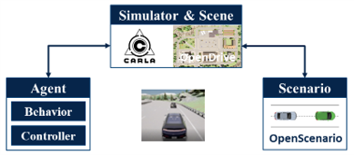

# Intelligent Vehicles (Basic Version)

This is a repository for the basic version of intelligent vehicles, which is on the basis of the trajectory tracking. It is mainly used to organize my open-sourced projects, and contains several related projects, researches, and tools of mine. Have fun with these :) 

## Technical Solution

Here is my technical solution, as shown in the figure below. The system supports both online and offline data for convenient debugging. Considering the test safety and the danger corner case, it could be evaluated with simulator, e.g. CARLA and MATLAB. 

* To achieve the basic trajectory tracking, the vehicle needs to know the answer of three main questions:
    * What is the world like? ---> Mapping: Generate the point cloud map of its world;
    * Where is it? ---> Localization: Get its location in the map;
    * What to track? ---> Trajectory Recording: Get the waypoints for it.

* To achieve trajectory tracking in the complex scenes, some auxiliary tasks is added:
    * Auxiliary Localization ---> RTK Localization: Get more accurate global GPS location via RTK;
    * Auxiliary Tracking ---> Lane Keeping: Realize localization-free lane tracking on the structural road leveraging the visual semantic information;
    * Real-time Obstacle Avoidance ---> MMW Radar Obstacle Detection & LiDAR Obstacle Cluster.

* To achieve more complex tasks on the basis of trajectory tracking, some additional things are needed to take into consideration:
    * How to cooperate with others? ---> Remote Scheduling: Realize the macro vehicle scheduling and take the advantage of the V2X;
    * How to understand the surrounding environment better? ---> Environment Perception: make the full use of the input data from sensors.

## Basic System for Trajectory Tracking

The basic system is designed as below to give the three key answers previously mentioned.

Here are some related projects of mine:
* [ROS_NDT_Mapping](https://github.com/leofansq/ROS_NDT_Mapping): A ROS project for mapping based on NDT;
* [ROS_NDT_Localizer](https://github.com/leofansq/ROS_NDT_Localizer): A ROS project for localization based on NDT;
* [ROS_Waypoints_Processor](https://github.com/leofansq/ROS_Waypoints_Processor): A ROS project for waypoints processing, including recording and loading;
* [ROS_Pure_Pursuit](https://github.com/leofansq/ROS_Pure_Pursuit): A ROS project for tracking.

> The CAN Communication and the Actuator Execution depend on the specific equipment and device, which would not be open-sourced.

## Auxiliary Tasks

Some projects for the auxiliary tasks are listed below:

* [ROS_Object_Cluster](https://github.com/leofansq/ROS_Object_Cluster): A ROS project for LiDAR obstacle cluster;
* [Lane_Follower](https://github.com/leofansq/Lane_Follower): A project for visual lane keeping, including a lane detector and a YOLO5-based object detector.

    

## Environment Perception

Environment perception is one of the most popular applications in computer vision. Here are some of my research works:

* [FII-CenterNet](https://github.com/leofansq/FII-CenterNet): An anchor-free detector with foreground attention for traffic object detection (IEEE-TVT)

    

* [SCF-Net](https://github.com/leofansq/SCF-Net): Learning Spatial Contextual Features for Large-Scale Point Cloud Segmentation (CVPR2021)

    

Some tools for it are listed below:

* [Tools_Merge_Image_PointCloud](https://github.com/leofansq/Tools_Merge_Image_PointCloud): A tool for pc2img projection & colored pc generation;
* [Tools_RosBag2KITTI](https://github.com/leofansq/Tools_RosBag2KITTI): A tool for the file conversion from ROSBAG to KITTI format;
* [Tools_make_planes](https://github.com/leofansq/Tools_make_planes): A tool for planes generation of KITTI.

## Simulation Test

There are several simulator can be used for simulation test, and two of them were utilized in my previous works. The visual effects are better in CARLA, while it is more convenient for quantitative evaluation on MATLAB. The structures are shown below, but the code would not be open-sourced.

* Simulation test on MATLAB
    
    

* Simulation test on CARLA
    
    

